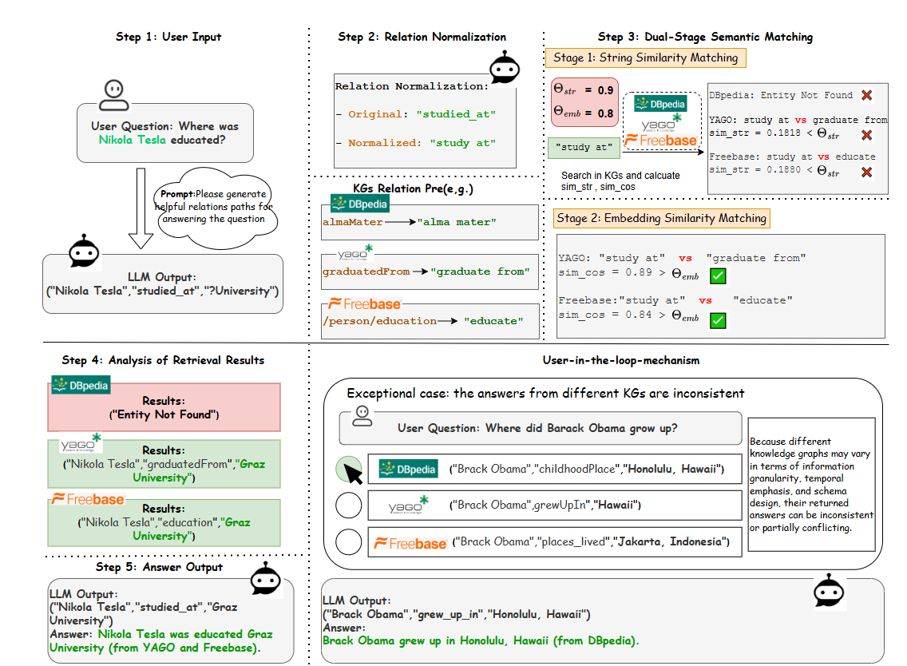

# RPA

A method that aligns relation paths generated by LLMs with canonical relations across multiple knowledge graphs. RPA performs this alignment through relation normalization, KG-side index construction, and a dual-stage semantic matching strategy.
RPA-KGQA: Relation Path Alignment for Multi-Knowledge-Graph QA

This project implements the Relation Path Alignment (RPA) module for aligning large language model (LLM)-generated relation paths to heterogeneous knowledge graphs (KGs), enabling robust and interpretable reasoning across multiple graphs.

🧩 Features

- Unified path normalization
- Dual-stage relation matching (string + semantic)
- Multi-KG querying
- User-in-the-loop answer selection
📂 Project Structure

rpa-kgqa/
├── matcher.py              # Dual-stage relation matching
├── normalize.py            # Relation name preprocessing
├── kg_index.py             # Build KG-side relation index
├── query_executor.py       # KG triple querying
├── user_resolution.py      # Resolve conflicting answers via user
├── experiments/
│   └── run_experiments.py  # Entry script with ablation
├── data/                   # Dataset files
├── results/                # Output logs
└── README.md

